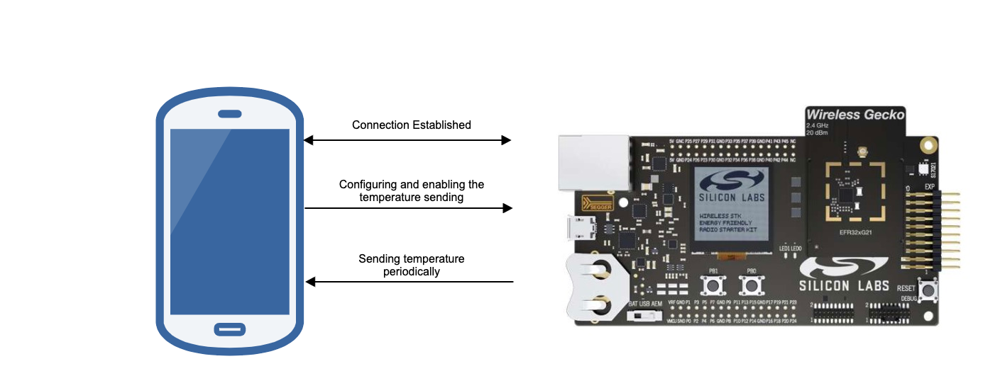
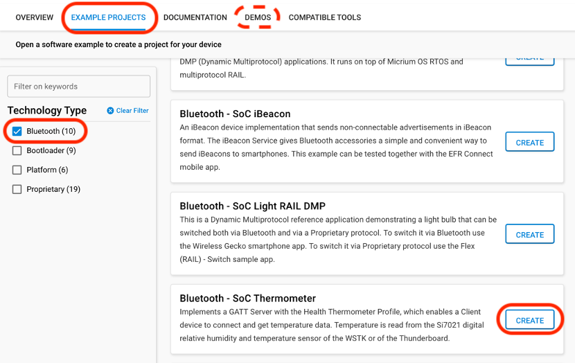
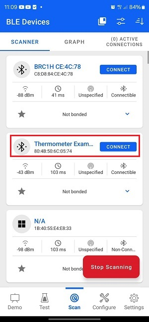
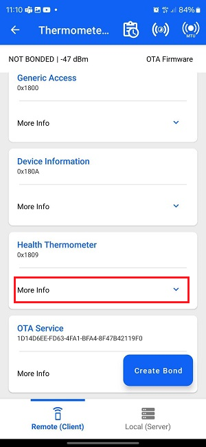
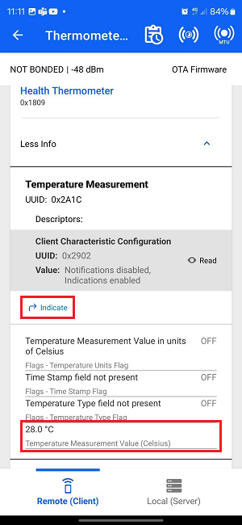
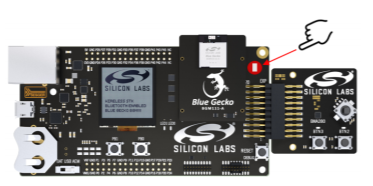
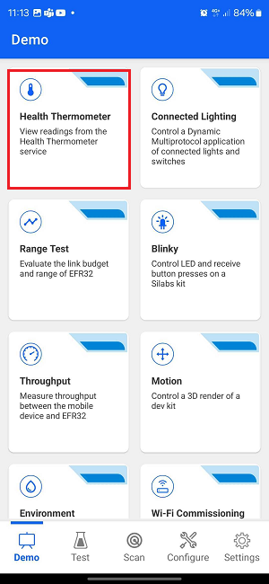
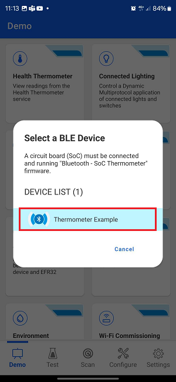
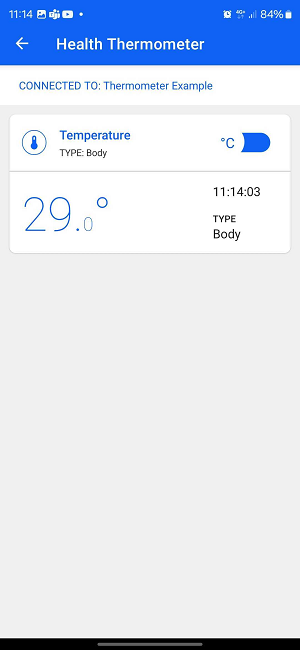
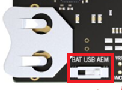

# SoC - Thermometer

This project implements the Health Thermometer service. It enables a peer device to connect and receive temperature values via Bluetooth. It is the Silicon Labs "Bluetooth - SoC Thermometer (Mock)" example for the BGM220PC22HNA module (BRD4314A, Simplicity SDK 2026.6.0), extended with firmware update over Bluetooth and automated releases. The board has no temperature sensor; the reported value is generated and changes by 1 degree Celsius every second.

## Status

| Part | State |
|------|-------|
| Thermometer application | Works |
| Temperature and firmware version in the advertisement (BTHome v2) | New in 1.1.0; not yet confirmed on hardware |
| Firmware update over Bluetooth (in-place OTA DFU, Apploader bootloader) | Works; verified on hardware with the Simplicity Connect app |
| Release build on GitHub | Works; every `vX.Y.Z` tag publishes a release |
| Own phone app | Works; update from a release verified on hardware with Android and iOS |
| Image signing, secure boot, access control for updates | Not done. Any connected client can start an update. Development use only |

Details of the update setup, flash layout, bootloader and manual procedures are in [OTA.md](OTA.md).

## Advertising

While no client is connected, the device advertises every 100 ms and can be connected to. The advertisement carries temperature and firmware version in [BTHome v2](https://bthome.io/format/) format, so BTHome receivers can read them without connecting. The temperature is measured anew every second.

| Packet | Content |
|--------|---------|
| Advertising data | Flags, service UUID `1809` (Health Thermometer), service data `FCD2` (BTHome v2, not encrypted): temperature (object `0x02`) and firmware version (object `0xF2`) |
| Scan response | Device name `Thermometer Example` |

Receivers that scan passively do not get the scan response and therefore no name. While a client is connected the device does not advertise. The data is built in [bthome.h](bthome.h).

## Releases and CI build

Released firmware is at <https://github.com/mhaberler/bt_soc_thermometer_mock/releases>. Each release carries

- `bt_soc_thermometer_mock.gbl`, the image for an update over Bluetooth,
- `bt_soc_thermometer_mock.s37`, the image for flashing by cable (needs the bootloader, see [OTA.md](OTA.md)).

A release is made by pushing a tag:

```sh
git tag v1.2.3
git push origin v1.2.3
```

The workflow [.github/workflows/release.yml](.github/workflows/release.yml) builds the firmware on a GitHub runner and publishes both files. The tag sets the firmware version: `v1.2.3` yields firmware that reports `1.2.3` in the Firmware Revision characteristic (`2A26`) and in the boot log. Tags must have the form `vMAJOR.MINOR.PATCH`. Started by hand ("Run workflow"), the workflow only builds, as version `0.0.0`, and keeps the images as a workflow artifact.

The runner needs no Simplicity Studio. The SDK sources used by the project are part of this repository, the compiler is the Arm GNU toolchain 14.2, and Simplicity Commander, which creates the GBL file, is fetched from the Silicon Labs update site.

Local builds report version `0.0.0`. How to build locally is described in [OTA.md](OTA.md).

## Phone app

[thermometer-ota-app](https://github.com/mhaberler/thermometer-ota-app) is a companion app for Android and iOS. It scans for the thermometer, shows temperature and firmware version, looks up the latest release of this repository, and offers an update when the release is newer than the firmware on the device. It can also load a GBL file from any URL.

The Simplicity Connect app from Silicon Labs works as well, both for reading the temperature and for updates.

## Getting Started

To get started with Silicon Labs Bluetooth and Simplicity Studio, see [QSG169: Bluetooth SDK v3.x Quick Start Guide](https://www.silabs.com/documents/public/quick-start-guides/qsg169-bluetooth-sdk-v3x-quick-start-guide.pdf).

This example implements the predefined [Thermometer Service](https://www.bluetooth.com/xml-viewer/?src=https://www.bluetooth.com/wp-content/uploads/Sitecore-Media-Library/Gatt/Xml/Services/org.bluetooth.service.health_thermometer.xml). To run this example, you will need:

- A mainboard with Bluetooth Low Energy-compatible [radio board](https://www.silabs.com/wireless/bluetooth).
- An *[iOS](https://itunes.apple.com/us/app/silicon-labs-blue-gecko-wstk/id1030932759?mt=8)* or *[Android](https://play.google.com/store/apps/details?id=com.siliconlabs.bledemo)* smartphone with Simplicity Connect app installed.

The following picture shows the system view of how it works.



Follow these steps to get the temperature value on your smartphone.

1. Flash the bootloader and the application to your board, see [OTA.md](OTA.md). The picture shows the stock example in Simplicity Studio.



2. Open the *Simplicity Connect* app on your smartphone and allow the permission requested the first time it is opened.

3. Click [Scan]. You will see a list of nearby devices that are sending Bluetooth advertisement. Find the one named "Thermometer Example" and click the `connect` button on the right side.



4. Wait for the connection to establish and GATT database to be loaded, then find the *Health Thermometer* service, and click `More Info`.



5. Four characteristics will show up. Find the *Temperature Measurement* and press the `indicate` button. Then, you will see the temperature value getting updated periodically. You should also see the temperature displayed change as you press the top of the sensor with your finger, as shown below. On this board a generated value is shown which changes 1 degree Celsius every second.





Alternatively, you can follow the steps below instead of steps 3-5 to use the Health Thermometer feature in the app. This will automatically scan and list devices advertising the Health Thermometer service and, upon connection, will automatically enable notifications and display the temperature data.





## Device Firmware Update

This project uses the In-place OTA DFU component together with the Bluetooth Apploader OTA DFU bootloader. A GBL file is created by a post-build step. See [OTA.md](OTA.md) for how it was set up and how to use it.

For reference, Silicon Labs offers two Over-the-Air (OTA) DFU implementations for SoC applications:

|                           | In-place OTA DFU                 | Application OTA DFU                 |
|---------------------------|----------------------------------|-------------------------------------|
| **Component to add**      | In-place OTA DFU                 | Application OTA DFU                 |
| **Compatible bootloader** | Bluetooth Apploader OTA DFU      | Bootloader - SoC Internal Storage (Series 2) <br> Bootloader - SoC Storage (Series 3) |
| **Reference solution**    | Bluetooth - SoC In-Place OTA DFU | Bluetooth - SoC Application OTA DFU |
| **Supported devices**     | Supports Series 2 devices only and requires a smaller flash size | Supports Series 2 and Series 3 devices with enough flash to store firmware images in 2 instances |

For more information on bootloaders, see [UG103.6: Bootloader Fundamentals](https://www.silabs.com/documents/public/user-guides/ug103-06-fundamentals-bootloading.pdf) and [UG489: Silicon Labs Gecko Bootloader User's Guide for GSDK 4.0 and Higher](https://www.silabs.com/documents/public/user-guides/ug489-gecko-bootloader-user-guide-gsdk-4.pdf).

## Troubleshooting

### Programming the Radio Board

Before programming the radio board mounted on the mainboard, make sure the power supply switch is in the AEM position (right side) as shown below.




## Resources

[Bluetooth Documentation](https://docs.silabs.com/bluetooth/latest/)

[UG103.14: Bluetooth LE Fundamentals](https://www.silabs.com/documents/public/user-guides/ug103-14-fundamentals-ble.pdf)

[QSG169: Bluetooth SDK v3.x Quick Start Guide](https://www.silabs.com/documents/public/quick-start-guides/qsg169-bluetooth-sdk-v3x-quick-start-guide.pdf)

[UG434: Silicon Labs Bluetooth ® C Application Developer's Guide for SDK v3.x](https://www.silabs.com/documents/public/user-guides/ug434-bluetooth-c-soc-dev-guide-sdk-v3x.pdf)

[Bluetooth Training](https://www.silabs.com/support/training/bluetooth)

[Bluetooth SIG thermometer profile specification](https://www.bluetooth.org/docman/handlers/downloaddoc.ashx?doc_id=238687&_ga=2.28821308.120082263.1538382903-201228904.1529395147)

## Report Bugs & Get Support

You are always encouraged and welcome to report any issues you found to us via [Silicon Labs Community](https://www.silabs.com/community).
